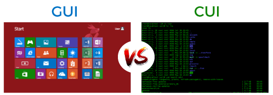
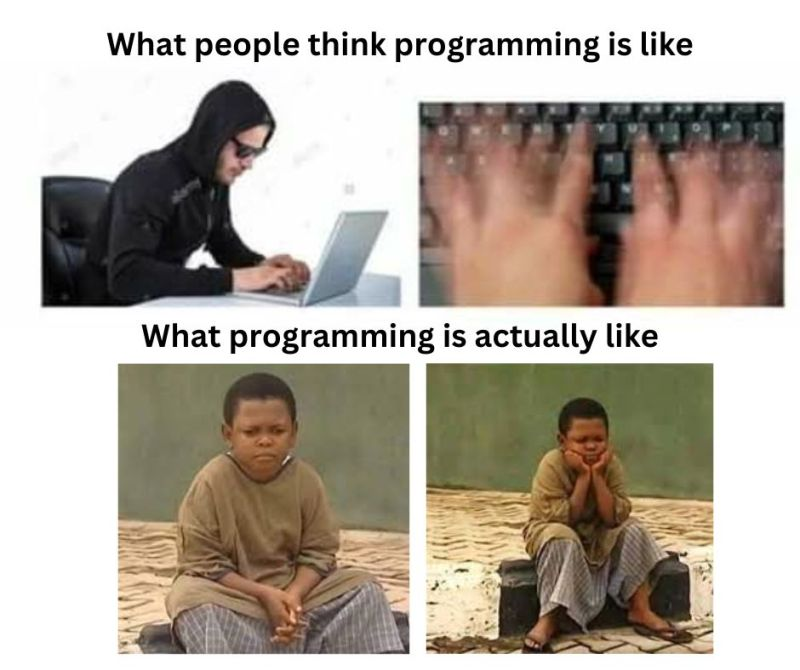

## What is Programming?

You may or may not be wondering, what programming actually is.
Simply put, it is the User (you) communicating with your computer through `code`.
Programming is the process of writing instructions that a computer can follow to complete specific tasks. These instructions, known as `code`, are written in a structured way using a `programming language`. Just like human languages have grammar and syntax, programming languages have rules that define how instructions must be written.

At its core, programming involves:

1- Defining a task – What do we want the computer to do?

2- Breaking it down – What steps are needed to achieve this?

3- Writing the instructions – Using a programming language to express these steps.

For example

          num1 = 5  
          num2 = 10  
          num3 = 15  
          average = (num1 + num2 + num3) / 3  
          print("The average is:", average)`

## Why should I care about programming?

Recent development of `Artifical Intelligence (AI)` has made it clear, that advances in technology are rapid. There are AI `models` or `agents` that are able to perform language based tasks like ("Summarize this book chapter", "write me a motivation letter for this student assistant position", "help me express my feelings for that person I like") with incredible outcomes. Their predecessor were `computer vision` models that were able to `mirror` human brain activity by showing similarity in their artifical activations. Although that topic (e.g., are AI models a good model of the human brain) is now highly debatable, [click here](https://bsky.app/profile/martinhebart.bsky.social/post/3ld2rxfcb5s2y) for a superb bluesky thread on that. 

To make a long story short, all these advances are based and solidified in programming. None of these advances were possible without programming, e.g. without instructing the computer to do a certain task. But do you need to be a rising neuroscientist star, that develops the newest AI model to use programming? No, not even close!

For starters, programming is a `tool` that you can use to make your life easier. It can help you with very basic tasks, like creating a new `folder` on your desktop. Of course, you can just make a right click within your *directory* and choose `create new folder`. In programming you could do something like 

          os.mkdir("MyNewFolder")

and you would basically get the same output. Okay, that is hardly an argument for learning a programming language. But what if you had to create 100 folders in your new directory, all named in the following scheme "Folder_0, Folder_1 (...) Folder_100. Doing that task `manually` would be.. tiresome, to say the least.

You might have guessed that in programming you could just do the same thing within *seconds*.

          for i in range(100):
                    os.mdkir(f"MyNewFolder_{i}")

Programming really shines in these sort of use cases. It is a very neat way to communicate with your computer and to save yourself a lot of hours. Again, it does not stop there. Thinking of Data Analysis, knowing how to program gives you a huge advantage. While you would otherwise be stuck with `GUI` based tools like `SPSS`, where you are *highly* dependent on the available tools and options the GUI provides to you, knowing how to program really helps here.
Instead of clicking through menus and manually repeating analyses, you can automate workflows, handle large datasets with ease, and customize your analysis exactly as needed. Programming also opens the door to advanced techniques like machine learning, complex statistical modeling, and data visualization, which go far beyond the built-in options of GUI-based software. 

Of course, this is not neccessarily limited to Python. `R` is another great option for that. By now you are probably wondering, why should I learn Python then?

## Why Python?

To start, there are a lot of programming languages out there. There is *C*, *C#*, *java*, *javascript*, *julia*, *PHP*, *Rust*, *Swift* and so on.

Now, why choose Python?

It is not only pretty popular, it is also a beginner friendly language. It has a easy to read syntax and learning the concepts of the language is rather easy. 
Besides, it has a very active community, so should you encounter any difficulties, you are very likely to find a neat `documentation` or `thread` in which some has already discussed your problem (or, you just open a thread yourself!; for example: [stackoverflow](https://stackoverflow.com/questions/tagged/python)). Further, Python is **open source**. That means, that anybody that has a laptop can actually run it. You do not need to pay a dime for it. 

If you are interested in machine learning and deep learning, python is also the best language to learn. Most models are actually coded in python. 

Here are a list of cool projects coded in python (In no particular order!)

1. [Automatic Water Gun attack on pigeons](https://maxnagy.com/posts/pigeons/)

2. [Using Python to explore outer space](https://github.com/readme/featured/webb-telescope-astropy)

3. [Reconstructing images from our brain to pixels](https://journals.plos.org/ploscompbiol/article/file?id=10.1371%2Fjournal.pcbi.1006633&type=printable)

And there are of course many more!

## How do I get help?

Before finally starting with our first coding exercise, there should be some things mentioned.

First of all, you should be aware that programming can be hard and frustrating. Feeling that way is completely normal! Learning a new skill is always a ambitious endeavour and programming definitely counts in to that. So what should you do when you feel frustrated? I recommend to take a brief walk, enjoy a beverage of your choice or just take your mind off of things. Or watch funny youtube videos (but dont get stuck and just end up funny youtube videos). Most importantly, remind yourself that whatever you are trying to learn is not easy nor trivial. And trying to learn programming is already really cool, so go you!  Programming is not really like "hollywood" likes to depict it. It is pretty cool, but for most of us mortal folks, it does not involve hacking into the goverment database, while typing your code *flawless* at lightning speed. So try to be aware of that and set yourself some realistic expectations.

Besides these minor psychological interventions, there are of course practical ones.

For example yes, you are not only allowed to google stuff, you are actually **encouraged** to do so. The internet has many many great resources to offer to you when it comes to programming. It is actually very common, that you google your specific coding problem and see that someone else has actually posed the same question before you! There are many forums in which coding problems are discussed, most prominently that is [stackoverflow](https://stackoverflow.com/questions/tagged/python). People in the programming community are usually really nice people, as long as you are kind and respectful. So do not ever hesitate to reach out for help there! Minor caveat: The common language in these forums is English. So you will have better luck finding your answers if you pose your question in english aswell.

To adress the elephant in the room, yes, you are also *technically* allowed to use Large Language Models (LLMs) like ChatGPT. I'd say not using them nowdays is pretty foolish. However, there is a distinction between letting ChatGPT do your stuff or it actually helping you to understand your coding problem. Of course, you can solve most basic demands trivially with these LLMs. However, once their website is down or whatever, you are pretty much stuck. Thats why it is really important to build a solid foundation **first** and *then* look in to the options of using LLMs. Really try to think for yourself and only use these models as a last resort. I would always prefer using a resource like stackoverflow (or the holy grail, the code documentation base for the `module` you are using) over LLMs, especially when you are just learning the language. So try to keep that in mind! You are absolutely free to use it and it can be very helpful in explaining some basic concepts to you. Yet, these models can make mistakes aswell.

A better option could be to talk with your course instructor (Me) or with your fellows (other students).

TLDR: Be mindful about using LLMs, always try to deepen your understanding first. 
