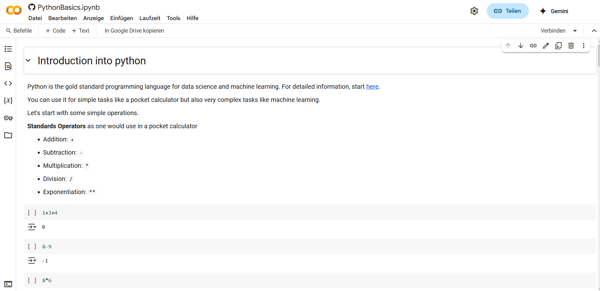

## How does this course work?

For this course, we will do all the coding work in google colab. This has multiple advantages: You do not need to worry about installing any program on your device. You do not need to worry about specific `coding environments`.

What are coding environments you ask? In short: 

These environments are the holy grail to solve the "Works on my machine" problem. Since google colab is cloud based, we can intitialize these environments there and thus are worry free. For your future work, it is *highly* recommend to use these. If you are interested in how these things work, just let me know.

How do we start our python session? On the course website, you should see these icons on the top of your screen:

If you hover your mouse over the rocket thing, you should see **"Colab"** pop-up. You can then simply click on **Colab** to start the python session. 

CAVEAT: Starting your session via **Colab** will only work, if the webpage you are viewing is linked to a python notebook. So you cannot start a colab session in this webpage right now (and there is obviously no need for that).

## What am I seeing now?

What you now see on your screen is what we call a `Jupyter Notebook`, as indicated by the `.ipynb` extension. Jupyter Notebooks are an awesome invention to allow you to add both `text` and `code` elements in your workflow! They allow for highly interactive coding time.

We will only use the jupyter notebooks for this course. But just so you know, this is not the only `IDE` (integrated development environment) that you can run python on. There is [`Visual Studio Code`](https://code.visualstudio.com/), [`Spyder`](https://www.spyder-ide.org/) or [`PyCharm`](https://www.jetbrains.com/pycharm/) and of course many more.
So IDEs are basically the *interface* you use to interact with your computer to do certain tasks, via code. For example, I am actually using Visual Studio Code right now to set up the course website.